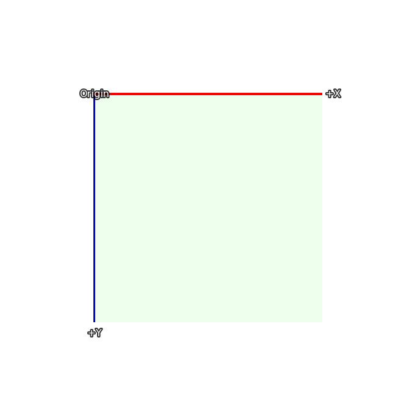
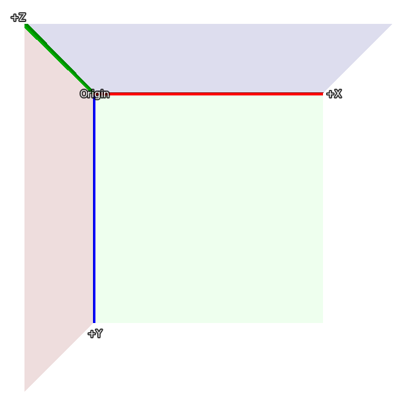
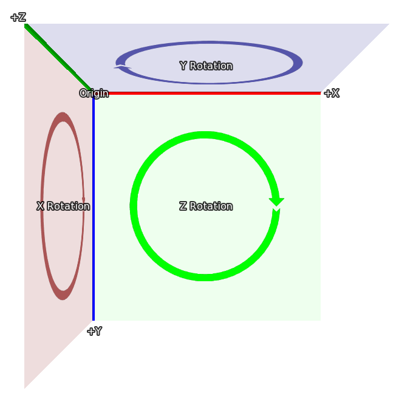

.. _3dstage:

3D-сцена
========

3D-сцена, названная в честь театральных подмостков, на которых разыгрываются спектакли, – это концепция, позволяющая размещать отображаемые объекты в трёх измерениях. Ren'Py отрисовывает их с правильной перспективой, а также делает доступным измерение Z, что позволяет реализовать такие вещи, как освещение и рендеринг глубины.

Координаты
----------

Вероятно, самое важное, что нужно понять о 3D-сцене, — это система координат, которую Ren'Py использует для 3D-состояния. Вот система координат, которая используется для размещения отображаемых объектов в 2D:

В 2D прямоугольник соответствует размеру экрана, а ширина и высота видимой области задаются с помощью :func:`gui.init` (обычно при создании новой игры).

3D-сцена расширяет эту систему координат новой осью, направленной к зрителю. Таким образом, значения больше 0 приближают изображение (и делают его больше), а значения меньше 0 отдаляют его от зрителя (и делают его меньше).

Наконец, когда происходит вращение в 3D, оно происходит в указанных здесь направлениях:

*   При вращении вокруг Z, X движется к Y.
*   При вращении вокруг X, Y движется к Z.
*   При вращении вокруг Y, Z движется к X.

Эти системы координат основаны на тех, что используются в Ren'Py, что упрощает переход от 2D к 3D-сцене. При импорте 3D-моделей могут применяться преобразования координат, чтобы обеспечить их корректность.

Камера
------

Начальное положение камеры контролируется параметрами :func:`gui.init`. Сначала Ren'Py использует `width` и `fov` для вычисления расстояния `z` по умолчанию. Для `fov` по умолчанию, равного 75:

*   Когда width = 1280, z составляет примерно 834
*   Когда width = 1920, z составляет примерно 1251
*   Когда width = 3840, z составляет примерно 2502

При этом фактическое значение z менее чем на 1 превышает приведённые здесь значения. Положение z по умолчанию можно переопределить с помощью стилевого свойства :tpref:`perspective` или переменной :var:`config.perspective`.

Ren'Py автоматически применяет к камере смещение (`width` / 2, `height` / 2, `z`), и она смотрит вдоль оси -Z.

Расстояние `z` – это также расстояние от камеры до плоскости, на которой пиксели на экране имеют тот же размер, что и в исходных изображениях (без учёта масштабирования окна). Увеличение z-позиции камеры сделает всё меньше, а уменьшение — больше.

Наконец, :tpref:`perspective` и :var:`config.perspective` описывают ближнюю и дальнюю плоскости отсечения, которые по умолчанию равны 100 и 100000 соответственно. Это означает, что если изображение находится ближе 100 z-единиц к камере, оно исчезает, а также исчезает, если оно находится на расстоянии более 100 000 z-единиц.

.. var:: config.perspective = (100, z, 100000)

    Значение по умолчанию, используемое, когда :tpref:`perspective` не задано в виде кортежа из трёх элементов. ``z`` зависит от размера игры, как описано выше.

Использование 3D-сцены
----------------------

Первое, что нужно сделать для использования 3D-сцены, — это включить её для слоя с помощью оператора ``camera``. Если имя слоя не указано, по умолчанию используется ``master``. Обычно это делается так::

    # Включение 3D-сцены для слоя master.
    camera:
        perspective True

хотя, возможно, вы захотите включить позицию камеры по умолчанию, как описано ниже.

Как вариант, можно указать конкретное имя слоя, чтобы включить 3D-сцену только для него. ::

    # Включение 3D-сцены для слоя background.
    camera background:
        perspective True

Отображение изображений (фонов и спрайтов) работает так же, как и при использовании 2D-координат. ::

    scene bg washington

    show lucy mad at right

    show eileen happy

Однако можно использовать трансформации для перемещения этих отображаемых объектов в трёхмерном пространстве::

    scene bg washington:
        xalign 0.5 yalign 1.0 zpos -1000

    show lucy mad:
        xalign 1.0 yalign 1.0 zpos 100

    show eileen happy:
        xalign 0.5 yalign 1.0 zpos 200

Поскольку задана ATL-трансформация, трансформация по умолчанию не используется, и необходимо указать :tpref:`xalign` и :tpref:`yalign` для позиционирования отображаемого объекта по осям X и Y. Конечно, можно использовать и именованные трансформации. ::

    transform zbg:
        zpos -100

    transform z100:
        zpos 100

    transform z200:
        zpos 200

    scene bg washington at center, zbg

    show lucy mad at right, z100

    show eileen happy at center, z200

Если вы попробуете это, то увидите пустое пространство вокруг фона. Это происходит потому, что при смещении назад фон становится меньше и не заполняет весь экран. В Ren'Py есть простой способ решить эту проблему — :tpref:`zzoom`. Установка свойства :tpref:`zzoom` в `True` масштабирует изображение на величину, на которую оно было уменьшено из-за отрицательного `zpos`. Это полезно для фонов. ::

    transform zbg:
        zpos -100 zzoom True

Также возможно использовать ATL для изменения `zpos`, так же, как вы бы делали с `xpos` и `ypos`. ::

    show eileen happy at center:
        zpos 0
        linear 4.0 zpos 200

Обратите внимание, что `zpos` может странно взаимодействовать с такими позициями, как ``left`` и ``right``, а также со свойствами :propref:`xalign` и :propref:`yalign`. Это связано с тем, что Ren'Py располагает изображения в трёхмерном прямоугольном объёме (подобно кубу, но не все стороны имеют одинаковую длину), а затем применяет к изображению перспективу, что может привести к смещению частей изображения за пределы экрана.

Также можно перемещать камеру с помощью ``camera``. Например, ::

    camera:
        perspective True
        xpos 0
        linear 3.0 xpos 500

При этом, вероятно, имеет смысл использовать фоновые изображения, размер которых превышает размер окна.

Если вы применяете `zpos` к спрайту, но это не даёт эффекта, причина, скорее всего, в том, что вы пропустили блок ``perspective`` в трансформации ``camera``.

Камеру можно вращать с помощью::

    camera:
        perspective True
        rotate 45

Поскольку вращается именно камера, вращение происходит в направлении, противоположном вращению отображаемого объекта.

Глубина
-------

По умолчанию Ren'Py будет отображать изображения в своём обычном порядке: последнее показанное изображение будет находиться поверх остальных. Это может приводить к странным результатам, например, когда изображение, которое находится ближе (с учётом перспективы), отображается за тем, которое находится дальше.

Если ваша игра отображает изображения в неправильном порядке, вы можете указать GPU сортировать их по глубине с помощью :tpref:`gl_depth`::

    camera:
        perspective True
        gl_depth True

Небольшие ошибки округления могут привести к тому, что изображения, номинально находящиеся на одной и той же глубине, будут отображаться одно над другим или одно под другим. Решением этой проблемы может быть сведение этих изображений в одно и их совместное отображение.

Матричные трансформации
-----------------------

Ren'Py использует свойство трансформации :tpref:`matrixtransform` для применения матрицы к отображаемым объектам, что позволяет масштабировать, смещать и вращать изображение в трёхмерном пространстве. Это свойство принимает либо :func:`Matrix`, либо `TransformMatrix` (определённый ниже) и применяет его к вершинам в углах отображаемых изображений.

Ren'Py использует свойство трансформации :tpref:`matrixanchor`, чтобы упростить применение матрицы. По умолчанию оно равно (0.5, 0.5) и преобразуется в пиксельное смещение внутри трансформируемого изображения с использованием обычных правил якорей Ren'Py. (Если это целое число или absolute, оно считается количеством пикселей, в противном случае — долей от размера изображения.)

Ren'Py применяет трансформацию, сначала смещая изображение так, чтобы якорь находился в точке (0, 0, 0). Затем он применяет трансформацию и смещает изображение обратно на ту же величину. При значениях по умолчанию это означает, что матрица будет применена к центру изображения.

Например::

    show eileen happy at center:
        matrixtransform RotateMatrix(45, 0, 0)

Это повернёт изображение вокруг горизонтальной линии, проходящей через его центр. Верхняя часть изображения сместится назад, а нижняя — вперёд.

Матрицы можно объединять в цепочку с помощью умножения. Проще всего представлять, что они применяются справа налево. В этом примере::

    show eileen happy at center:
        matrixtransform RotateMatrix(45, 0, 0) * OffsetMatrix(0, -300, 0)

Изображение будет смещено вверх на 300 пикселей, а затем повёрнуто вокруг оси X.

Структурное сходство
^^^^^^^^^^^^^^^^^^^^

В ATL интерполяция свойства :tpref:`matrixtransform` требует использования объектов `TransformMatrix`, имеющих структурное сходство. Это означает, что должны использоваться те же типы `TransformMatrix`, перемноженные в том же порядке.

Например, следующий код повернёт и сместит изображение, а затем вернёт его в исходное состояние::

    show eileen happy at center:
        matrixtransform RotateMatrix(0, 0, 0) * OffsetMatrix(0, 0, 0)
        linear 2.0 matrixtransform RotateMatrix(45, 0, 0) * OffsetMatrix(0, -300, 0)
        linear 2.0 matrixtransform RotateMatrix(0, 0, 0) * OffsetMatrix(0, 0, 0)

Хотя первая установка `matrixtransform` может показаться излишней, она необходима для создания основы для первой линейной интерполяции. Если бы её не было, эта интерполяция была бы пропущена.

TransformMatrix
---------------

Хотя объекты `Matrix` подходят для статических трансформаций, они не годятся для анимации изменяющихся трансформаций. Также полезно иметь способ брать стандартные матрицы и инкапсулировать их так, чтобы их можно было параметризовать.

`TransformMatrix` — это базовый класс, который расширяется рядом классов, создающих матрицы. Экземпляры `TransformMatrix` вызываются Ren'Py и возвращают объекты `Matrix`. `TransformMatrix` хорошо интегрирован с ATL, что позволяет анимировать `matrixtransform`. ::

    transform xrotate:
        matrixtransform RotateMatrix(0.0, 0.0, 0.0)
        linear 4.0 matrixtransform RotateMatrix(360.0, 0.0, 0.0)
        repeat

Ожидается, что подклассы `TransformMatrix` будут реализовывать метод ``__call__``. Этот метод принимает:

*   Старый объект для интерполяции. Этот объект может быть любого класса и может быть `None`, если старого объекта не существует.
*   Значение от 0.0 до 1.0, представляющее точку интерполяции. 0.0 — это полностью старый объект, а 1.0 — полностью новый объект.

Встроенные подклассы TransformMatrix
------------------------------------

.. seealso:: :class:`SplineMatrix`, который работает с подклассами TransformMatrix.

Ниже приведён список подклассов TransformMatrix, встроенных в Ren'Py.

.. include:: inc/transform_matrix

Свойства трансформации
----------------------

Следующие свойства трансформации используются 3D-сценой.

.. transform-property:: matrixanchor

    :type: (position, position)
    :default: (0.5, 0.5)

    Задаёт положение якоря матрицы относительно изображения. Если переменные являются float, то положение задаётся относительно размера дочернего объекта, в противном случае — в абсолютных пикселях.

    Это устанавливает положение точки (0, 0, 0), к которой `point_to`, `orientation`, `xrotate`, `yrotate`, `zrotate` и `matrixtransform` применяют свои трансформации.

.. transform-property:: point_to

    :type: (float, float, float), Camera или None
    :default: None

    Задаёт позицию, на которую нужно указывать. Камера или трансформируемый отображаемый объект поворачиваются лицом к этой точке, даже если положение камеры или отображаемого объекта изменяется.

    Если это `None`, вращение к точке интереса не применяется.

    Если не `None`, то это кортеж из 3 элементов или экземпляр :func:`Camera`. Кортеж формата (x, y, z) представляет позицию точки интереса. Экземпляр `Camera` означает, что нужно указывать на камеру.

    Обратите внимание, что `point_to` не обновляется автоматически. Поэтому, если вы хотите, чтобы он обновлялся, пишите так, как показано ниже::

        # Эйлин всегда смотрит на камеру.
        show eileen happy at center:
            point_to Camera()
            0
            repeat

    .. include:: inc/point_to_camera

.. transform-property:: orientation

    :type: (float, float, float) или None
    :default: None

    Вращает камеру или отображаемый объект. Три значения — это вращения по осям X, Y и Z в градусах. Вращения применяются в порядке x, y, z для отображаемых объектов и в порядке z, y, x для камеры.

    При использовании интерполяции с `orientation`, выбирается кратчайший путь между старой и новой ориентацией.

    Если это `None`, ориентация не применяется.

.. transform-property:: xrotate

    :type: float или None
    :default: None

    Вращает камеру или отображаемый объект вокруг оси X. Значение — это вращение в градусах. Вращения применяются к отображаемым объектам в порядке x, y, z. Вращения применяются к камере в порядке z, y, x.

    Если это `None`, вращение по оси X не применяется.

.. transform-property:: yrotate

    :type: float или None
    :default: None

    Вращает камеру или отображаемый объект вокруг оси Y. Значение — это вращение в градусах. Вращения применяются к отображаемым объектам в порядке x, y, z. Вращения применяются к камере в порядке z, y, x.

    Если это `None`, вращение по оси Y не применяется.

.. transform-property:: zrotate

    :type: float или None
    :default: None

    Вращает камеру или отображаемый объект вокруг оси Z. Значение — это вращение в градусах. Вращения применяются к отображаемым объектам в порядке x, y, z. Вращения применяются к камере в порядке z, y, x.

    Если это `None`, вращение по оси Z не применяется.

.. transform-property:: matrixtransform

    :type: None или Matrix или TransformMatrix
    :default: None

    Если не `None`, задаёт матрицу, которая используется для трансформации вершин дочернего объекта. Трансформация преобразует координаты, используемые экраном, в координаты, используемые дочерним объектом.

    Интерполяции с этим свойством поддерживаются только при использовании `TransformMatrix` и когда значения `TransformMatrix` структурно подобны, как описано выше.

.. transform-property:: perspective

    :type: True или False или Float или (Float, Float, Float)
    :default: None

    При применении к трансформации включает рендеринг в перспективе. Принимает кортеж из трёх элементов: ближняя плоскость отсечения, z-расстояние до плоскости 1:1 и дальняя плоскость отсечения.

    Если задано одно число (float), расстояния до ближней и дальней плоскостей берутся из :var:`config.perspective`. Если `True`, все три значения берутся из этой переменной.

    Когда `perspective` не равно `False`, значения :tpref:`xpos`, :tpref:`ypos`, :tpref:`zpos` и :tpref:`rotate` инвертируются, создавая эффект позиционирования камеры, а не дочернего объекта.

    Поскольку предполагается, что трансформация перспективы выровнена по окну, не имеет смысла изменять её положение с помощью :tpref:`xanchor` и :tpref:`yanchor` или свойств, которые их устанавливают, таких как :tpref:`anchor`, :tpref:`align`, :tpref:`center` и т.д.

.. transform-property:: zpos

    :type: float
    :default: 0

    Смещает дочерний объект вдоль оси Z. Когда `perspective` равно `False`, это значение используется напрямую, в противном случае оно умножается на -1 и используется.

    Если установка этого свойства приводит к исчезновению дочернего объекта, вероятно, для данной трансформации не активен режим перспективы.

.. transform-property:: zzoom

    :type: bool
    :default: False

    Если `True`, определяется z-расстояние до плоскости 1:1 (`zone`), а также `zpos` данного отображаемого объекта. Затем дочерний объект масштабируется по осям X и Y на величину (`zone` - `zpos`) / `zone`.

    Предполагаемое использование этого свойства — отображение фона с отрицательным `zpos`, что обычно делает фон маленьким. Установка этого свойства в `True` означает, что фон будет отображаться в размере 1:1.