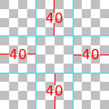
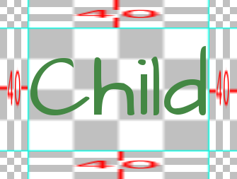
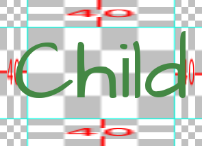
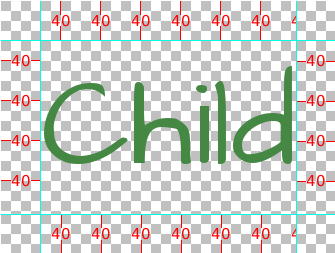

.. _gui:

============================
Руководство по настройке GUI
============================

.. ifconfig:: not renpy_figures

    .. note::

        В этой версии документации изображения опущены для экономии места.
        Чтобы просмотреть полную версию, пожалуйста, посетите
        https://www.renpy.org/doc/html/gui.html

В Ren'Py есть система GUI, которая (мы надеемся) выглядит привлекательно «из коробки»,
может быть частично настроена и, при необходимости, полностью заменена.
Эта страница объясняет, как выполнять простую и среднюю настройку GUI.

Для более продвинутой настройки, пожалуйста, ознакомьтесь с документацией по
:doc:`стилям <style>` (включая список :doc:`свойств стилей <style_properties>`)
и :doc:`экранам <screens>` (включая :doc:`действия экранов <screen_actions>`
и :doc:`специальные экраны <screen_special>`).

Предполагается, что вы используете GUI Ren'Py нового стиля (содержащийся в файле :file:`gui.rpy`).
Старые GUI (которые используют файл :file:`screens.rpy`) следует рассматривать как
продвинутую настройку GUI в рамках этого руководства.

Простая настройка GUI
=====================

Есть несколько простых элементов настройки GUI, которые имеют смысл для всех, кроме самых простых визуальных новелл.
Общим для этих настроек является то, что они не требуют редактирования файла :file:`gui.rpy`.
Эти настройки несколько изменяют GUI, но не меняют его внешний вид кардинально.

Изменение размера и цветов
--------------------------

Самое простое, что можно изменить в GUI — это его размер и цвет.
Ren'Py предложит вам сделать этот выбор при первом создании проекта, но
выбор «Change/Update GUI» в лаунчере позволит вам изменить свой выбор.

При изменении GUI через лаунчер Ren'Py спросит, хотите ли вы просто
изменить лаунчер или обновить :file:`gui.rpy`. Оба варианта перезапишут
большинство файлов изображений, а перезапись :file:`gui.rpy` приведёт к потере
изменений в этом файле.

В результате, вам, вероятно, следует сделать это до любых других настроек.

Ren'Py запросит разрешение проекта по умолчанию, а затем также цветовую схему
для использования. После того, как вы их выберете, он обновит GUI
в соответствии с вашим выбором.

Options.rpy
-----------

В файле :file:`options.rpy` есть несколько переменных, которые используются GUI.

:var:`config.name`
    Строка, задающая понятное человеку название игры. Используется в качестве заголовка окна
    и по всему GUI, где требуется название игры.

:var:`gui.show_name`
    Этой переменной следует присвоить значение False, чтобы скрыть название и номер версии
    в главном меню (например, если название «встроено» в изображение главного меню).

:var:`config.version`
    Строка, задающая версию игры. Она показывается пользователю в различных местах
    стандартного GUI. У неё есть и другие применения, например,
    в сообщениях об ошибках или traceback'ах.

:var:`gui.about`
    Дополнительный текст, который добавляется на экран «О программе». Если вы хотите использовать
    несколько абзацев для титров, можно использовать \\n\\n для их разделения.

Вот пример этих определений::

    define config.name = _('Old School High School')

    define gui.show_name = True

    define config.version = "1.0"

    define gui.about = _("Created by PyTom.\n\nHigh school backgrounds by Mugenjohncel.")

Для удобства имеет смысл определять `gui.about` с помощью строки в тройных
кавычках, в этом случае переносы строк сохраняются. ::

    define gui.about = _("""\
    Created by PyTom.

    High school backgrounds by Mugenjohncel.""")

Фоновые изображения игры и главного меню
----------------------------------------

Изображения, используемые GUI, находятся в каталоге `game/gui`, который
можно открыть, выбрав «Open Directory: gui» в лаунчере. Соответствующие файлы:

gui/main_menu.png
    Файл с изображением, которое используется в качестве фона для всех экранов
    главного меню.

gui/game_menu.png
    Файл с изображением, которое используется в качестве фона для всех экранов
    игрового меню.

.. ifconfig:: renpy_figures

    .. figure:: gui/easy_main_menu.jpg
        :width: 100%

        Главное меню, в котором заменён только файл :file:`gui/main_menu.png`.

    .. figure:: gui/easy_game_menu.jpg
        :width: 100%

        Экран «О программе» может быть частью игрового меню (используя :file:`gui/game_menu.png`
        в качестве фона) или главного меню (используя :file:`gui/main_menu.png`
        в качестве фона). Обоим можно задать одно и то же изображение.

Иконка окна
-----------

Иконка окна — это значок, который отображается запущенным приложением
(в таких местах, как панель задач Windows и док Macintosh).

Иконку окна можно изменить, заменив файл :file:`gui/window_icon.png`.

Обратите внимание, что это изменяет только иконку, используемую запущенной игрой.
Чтобы изменить иконку, используемую файлами .exe для Windows и приложениями Macintosh,
см. :ref:`документацию по сборке <special-files>`.

Средний уровень настройки GUI
=============================

Далее мы продемонстрируем средний уровень настройки GUI.
На среднем уровне можно изменять цвета, шрифты и изображения, используемые в игре.
В целом, при настройке среднего уровня экраны остаются в основном такими же,
с кнопками и полосами на тех же местах, хотя изменение экранов для
добавления новой функциональности, безусловно, возможно.

Многие из этих изменений включают редактирование переменных в файле :file:`gui.rpy`.
Например, чтобы увеличить размер шрифта диалога, найдите строку, которая гласит::

    define gui.text_size = 22

и увеличьте или уменьшите его, например, до::

    define gui.text_size = 20

Обратите внимание, что значения по умолчанию часто отличаются от тех, что приведены
в этой документации. Значения по умолчанию могут меняться в зависимости от размера
и цветов, выбранных для игры, а значения в этом файле являются примером
обширной настройки GUI. Лучше всего искать в файле :file:`gui.rpy` по `define` и
имени соответствующей переменной – например, ``define gui.text_size``.

Некоторые из приведённых ниже настроек частично или полностью влияют на файлы изображений.
В результате изменения вступают в силу только после обновления самих файлов изображений,
что можно сделать, выбрав «Change GUI» в лаунчере и указав ему
пересоздать файлы изображений. (Но обратите внимание, что это действие перезапишет
все файлы изображений, которые вы уже изменили.)

Возможно, вам стоит подождать, пока ваша игра будет почти завершена, прежде чем настраивать
:file:`gui.rpy` таким образом. Хотя старые файлы :file:`gui.rpy` будут работать
в новых версиях Ren'Py, новые файлы :file:`gui.rpy` могут иметь функции и исправления,
отсутствующие в старых версиях. Ранняя настройка GUI может затруднить
использование таких улучшений.

Диалог
------

Существует ряд относительно простых настроек, которые можно выполнить, чтобы изменить
способ отображения диалога для игрока. Первое — это изменение текстового поля (textbox).

gui/textbox.png
    Этот файл содержит фон текстового окна, отображаемого как часть
    экрана `say`. Хотя он должен быть во всю ширину игры, текст отображается только
    в центральных 60% экрана, с 20% отступом с каждой стороны.

Кроме того, существует ряд переменных, которые можно настроить для изменения диалога.

.. var:: gui.text_color = "#402000"

    Задаёт цвет текста диалога.

.. var:: gui.text_font = "ArchitectsDaughter.ttf"

    Задаёт шрифт, который используется для текста диалога, меню, полей ввода и
    другого внутриигрового текста. Файл шрифта должен находиться в каталоге игры.

.. var:: gui.text_size = 33

    Задаёт размер текста диалога. Возможно, его потребуется увеличить или уменьшить,
    чтобы выбранный шрифт поместился в отведённое пространство.

.. var:: gui.name_text_size = 45

    Задаёт размер имён персонажей.

По умолчанию метка с именем персонажа использует акцентный цвет (accent color). Цвет
можно легко изменить при определении персонажа::

    define e = Character("Eileen", who_color="#104010")

.. ifconfig:: renpy_figures

    .. figure:: oshs/game/gui/textbox.png
        :width: 100%

        Пример изображения текстового поля.

    .. figure:: gui/easy_say_screen.jpg
        :width: 100%

        Диалог, настроенный с использованием изображения текстового поля и указанных выше
        настроек переменных.

Меню выбора
-----------

Экран выбора (`choice`) используется оператором `menu` для отображения вариантов выбора игроку.
Опять же, есть несколько относительно простых настроек, которые можно
выполнить для экрана выбора. Первое — это два файла изображений:

gui/button/choice_idle_background.png
    Это изображение используется как фон кнопок выбора, на которых нет фокуса.

gui/button/choice_hover_background.png
    Это изображение используется как фон кнопок выбора, на которых есть фокус.

По умолчанию текст размещается в центральных 75% этих изображений.
Также есть несколько переменных, которые управляют цветом текста
в кнопках выбора.

.. var:: gui.choice_button_text_idle_color = '#888888'

    Цвет, используемый для текста кнопок выбора без фокуса.

.. var:: gui.choice_button_text_hover_color = '#0066cc'

    Цвет, используемый для текста кнопок выбора с фокусом.

Этого должно быть достаточно для простой настройки, где не нужно изменять
размер изображений. Для более сложных настроек ознакомьтесь с
разделом о кнопках ниже.

.. ifconfig:: renpy_figures

    .. figure:: oshs/game/gui/button/choice_idle_background.png
        :width: 100%

        Пример изображения :file:`gui/button/idle_background.png`.

    .. figure:: oshs/game/gui/button/choice_hover_background.png
        :width: 100%

        Пример изображения :file:`gui/button/choice_hover_background.png`.

    .. figure:: gui/easy_choice_screen.jpg
        :width: 100%

        Пример экрана выбора, настроенного с использованием изображений
        и указанных выше настроек переменных.

Изображения-наложения (Overlay)
-------------------------------

Также существует пара изображений-наложений (overlay). Они используются для затемнения или
осветления фонового изображения, чтобы сделать кнопки и другие компоненты
пользовательского интерфейса более читабельными. Эти изображения находятся в каталоге `overlay`:

gui/overlay/main_menu.png
    Наложение, используемое экраном главного меню.

gui/overlay/game_menu.png
    Наложение, используемое экранами игрового меню, такими как загрузка, сохранение,
    настройки, о программе, помощь и т. д. Это наложение выбирается
    соответствующим экраном и используется даже в главном меню.

gui/overlay/confirm.png
    Наложение, используемое на экране подтверждения для затемнения фона.

.. ifconfig:: renpy_figures

    Вот пара примеров изображений-наложений и то, как выглядит игра
    с добавленными наложениями.

    .. figure:: oshs/game/gui/overlay/main_menu.png
        :width: 100%

        Пример изображения :file:`gui/overlay/main_menu.png`.

    .. figure:: oshs/game/gui/overlay/game_menu.png
        :width: 100%

        Пример изображения :file:`gui/overlay/game_menu.png`.

    .. figure:: gui/overlay_main_menu.jpg
        :width: 100%

        Главное меню после изменения наложений.

    .. figure:: gui/overlay_game_menu.jpg
        :width: 100%

        Игровое меню после изменения наложений.

Цвета, шрифты и размеры шрифтов
-------------------------------

Существует ряд переменных GUI, которые можно использовать для изменения цвета, шрифта
и размера текста.

.. raw:: html

   
Этим переменным обычно следует присваивать шестнадцатеричные цветовые коды, которые представляют собой
   строки вида «#rrggbb» (или «#rrggbbaa» для указания альфа-компонента),
   аналогично цветовым кодам, используемым в веб-браузерах. Например, «#663399» — это код
   для оттенка <a href="http://www.economist.com/blogs/babbage/2014/06/digital-remembrance" style="text-decoration: none; color: rebeccapurple">фиолетового</a>.
   В интернете существует множество инструментов, позволяющих создавать HTML-коды цветов, например,
   <a href="http://htmlcolorcodes.com/color-picker/">этот</a>.

В дополнение к :var:`gui.text_color`, :var:`gui.choice_idle_color` и :var:`gui.choice_hover_color`,
описанным выше, существуют следующие переменные:

.. var:: gui.accent_color = '#000060'

    Акцентный цвет используется во многих местах GUI, включая заголовки
    и метки.

.. var:: gui.idle_color = '#606060'

    Цвет, используемый для большинства кнопок, когда на них нет фокуса или они не выбраны.

.. var:: gui.idle_small_color = '#404040'

    Цвет, используемый для мелкого текста (например, даты и имени слота сохранения,
    а также кнопок быстрого меню), когда на него не наведён курсор. Этот цвет часто
    должен быть немного светлее или темнее, чем `idle_color`, чтобы компенсировать
    меньший размер шрифта.

.. var:: gui.hover_color = '#3284d6'

    Цвет, используемый элементами GUI в фокусе, включая текст
    кнопок и ползунки (подвижные области) слайдеров и полос прокрутки.

.. var:: gui.selected_color = '#555555'

    Цвет, используемый текстом выбранных кнопок. (Имеет приоритет
    над цветами `hover` и `idle`.)

.. var:: gui.insensitive_color = '#8888887f'

    Цвет, используемый текстом кнопок, которые неактивны для пользовательского ввода.
    (Например, кнопка отката, когда откат невозможен.)

.. var:: gui.interface_text_color = '#404040'

    Цвет, используемый статическим текстом в интерфейсе игры, таким как текст на
    экранах помощи и «О программе».

.. var:: gui.muted_color = '#6080d0'
.. var:: gui.hover_muted_color = '#8080f0'

    Приглушённые цвета, используемые для секций полос, полос прокрутки и слайдеров,
    которые не представляют значение или видимую область. (Они используются только
    при генерации изображений и вступят в силу только после пересоздания изображений
    в лаунчере.)

В дополнение к :var:`gui.text_font` следующие переменные выбирают
шрифты, используемые для текста. Эти шрифты также должны быть размещены в каталоге игры.

.. var:: gui.interface_text_font = "ArchitectsDaughter.ttf"

    Шрифт, используемый для текста элементов пользовательского интерфейса, таких как главное и
    игровое меню, кнопки и так далее.

.. var:: gui.system_font = "DejaVuSans.ttf"

    Шрифт, используемый для системного текста, такого как сообщения об исключениях и меню
    доступности (Shift+A). Он должен поддерживать как ASCII, так и язык перевода
    игры.

.. var:: gui.glyph_font = "DejaVuSans.ttf"

    Шрифт, используемый для определённых глифов, таких как глифы стрелок, используемые
    индикатором пропуска. DejaVuSans является разумным выбором по умолчанию для этих глифов
    и автоматически включается в каждую игру Ren'Py.

В дополнение к :var:`gui.text_size` и :var:`gui.name_text_size` следующие
переменные управляют размерами текста.

.. var:: gui.interface_text_size = 36

    Размер статического текста в пользовательском интерфейсе игры и размер текста кнопок по
    умолчанию в интерфейсе игры.

.. var:: gui.label_text_size = 45

    Размер заголовков разделов в пользовательском интерфейсе игры.

.. var:: gui.notify_text_size = 24

    Размер текста уведомлений.

.. var:: gui.title_text_size = 75

    Размер заголовка игры.

.. ifconfig:: renpy_figures

    .. figure:: gui/text.jpg
        :width: 100%

        Игровое меню после настройки цветов, шрифтов и размеров текста.

Рамки (Borders)
---------------

Существует ряд компонентов GUI – таких как кнопки и полосы – которые используют
масштабируемые фоны, настраиваемые с помощью объектов `Border`. Прежде чем обсуждать,
как настраивать кнопки и полосы, мы сначала опишем, как это работает.

Рамки (`Borders`) передаются в `displayable` :func:`Frame`.
`Frame` принимает изображение и делит его на девять частей – четыре угла,
четыре стороны и центр. Углы всегда остаются одного размера,
левая и правая стороны растягиваются по вертикали, верхняя и нижняя стороны –
по горизонтали, а центр растягивается в обоих направлениях.

Объект `Borders` задаёт размер каждой из рамок, в порядке: левая, верхняя, правая,
нижняя. Так, если используется следующее изображение рамки:

вместе со следующими рамками::

    Borders(40, 40, 40, 40)

один из возможных результатов таков:

Когда дочерний элемент меняет размер, меняется и фон.

Объекту `Border` также можно задать отступ (padding), включая отрицательный отступ, который
заставляет дочерний элемент перекрывать рамки. Например, эти рамки::

    Borders(40, 40, 40, 40, -20, -20, -20, -20)

позволяют дочернему элементу перекрывать стороны. Обратите внимание, что из-за этого
перекрытия результат получается меньше, так как сами рамки теперь занимают меньше
места.

Рамки также можно замостить (tiled), а не масштабировать. Это вызывается
переменными и даёт следующий результат.

Эти примеры изображений немного некрасивы, так как нам нужно показать, что
происходит. На практике эта система может давать довольно приятные результаты.
Так происходит, когда `displayable` `Frame` используется в качестве фона для окна-рамки,
содержащего компоненты пользовательского интерфейса.

Эти окна-рамки можно настраивать двумя способами. Первый — это изменение
файла фонового изображения:

gui/frame.png
    Изображение, используемое в качестве фона для окон-рамок.

А второй — путём настройки переменных.

.. var:: gui.frame_borders = Borders(15, 15, 15, 15)

    Рамки, применяемые к окнам-рамкам.

.. var:: gui.confirm_frame_borders = Borders(60, 60, 60, 60)

    Рамки, применяемые к рамке, используемой на экране подтверждения.

.. var:: gui.frame_tile = True

    Если `true`, стороны и центр экрана подтверждения мостятся. Если `false`,
    они масштабируются.

.. ifconfig:: renpy_figures

    .. figure:: oshs/game/gui/frame.png
        :width: 100%

        Пример изображения :file:`gui/frame.png`.

    .. figure:: gui/frame_confirm.jpg
        :width: 100%

        Экран подтверждения после применения указанных выше настроек.

Кнопки
------

Пользовательский интерфейс Ren'Py включает в себя большое количество кнопок,
которые бывают разных размеров и используются для разных целей.
Существуют следующие виды кнопок:

button
    Основная кнопка. Используется для навигации в пользовательском интерфейсе.

choice_button
    Кнопка, используемая для выбора во внутриигровом меню.

quick_button
    Кнопка, отображаемая в игре, предназначенная для быстрого доступа
    к игровому меню.

navigation_button
    Кнопка, используемая в главном и игровом меню для навигации между экранами,
    и для начала игры.

page_button
    Кнопка, используемая для переключения между страницами на экранах загрузки и сохранения.

slot_button
    Кнопки, представляющие слоты файлов и содержащие миниатюру, время сохранения
    и необязательное имя сохранения. Они будут описаны более подробно ниже.

radio_button
    Кнопка, используемая для настроек с множественным выбором на экране настроек.

check_button
    Кнопка, используемая для переключаемых настроек на экране настроек.

test_button
    Кнопка, используемая для проверки воспроизведения звука на экране настроек. Она
    должна быть той же высоты, что и горизонтальный слайдер.

help_button
    Кнопка, используемая для выбора вида помощи, который нужен игроку.

confirm_button
    Кнопка, используемая на экране подтверждения для выбора «да» или «нет».

nvl_button
    Кнопка, используемая для выбора в меню в режиме NVL.

Следующие файлы изображений используются для настройки фонов кнопок,
если они существуют.

gui/button/idle_background.png
    Фоновое изображение для кнопок без фокуса.

gui/button/hover_background.png
    Фоновое изображение для кнопок в фокусе.

gui/button/selected_idle_background.png
    Фоновое изображение для кнопок, которые выбраны, но не в фокусе.
    Оно необязательно и используется вместо :file:`idle_background.png`, если существует.

gui/button/selected_hover_background.png
    Фоновое изображение для кнопок, которые выбраны и находятся в фокусе.
    Оно необязательно и используется вместо :file:`hover_background.png`, если существует.

Более специфичные фоны можно задать для каждого вида кнопок, добавив
к имени файла префикс вида кнопки. Например, :file:`gui/button/check_idle_background.png`
используется как фон для кнопок `check` без фокуса.

Четыре файла изображений используются как декорации переднего плана для `radio`
и `check` кнопок, чтобы показать, выбран ли вариант.

gui/button/check_foreground.png, gui/button/radio_foreground.png
    Эти изображения используются, когда `check` или `radio` кнопка не выбрана.

gui/button/check_selected_foreground.png, gui/button/radio_selected_foreground.png
    Эти изображения используются, когда `check` или `radio` кнопка выбрана.

Следующие переменные задают различные свойства кнопок:

.. var:: gui.button_width = None
.. var:: gui.button_height = 64

    Ширина и высота кнопки в пикселях. Если `None`, размер определяется
    автоматически на основе размера текста внутри кнопки, и указанных
    ниже рамок.

.. var:: gui.button_borders = Borders(10, 10, 10, 10)

    Рамки, окружающие кнопку, в порядке: левая, верхняя, правая, нижняя.

.. var:: gui.button_tile = True

    Если `true`, стороны и центр фона кнопки мостятся для увеличения или
    уменьшения их размера. Если `false`, стороны и центр масштабируются.

.. var:: gui.button_text_font = gui.interface_font
.. var:: gui.button_text_size = gui.interface_text_size

    Шрифт и размер текста кнопки.

.. var:: gui.button_text_idle_color = gui.idle_color
.. var:: gui.button_text_hover_color = gui.hover_color
.. var:: gui.button_text_selected_color = gui.accent_color
.. var:: gui.button_text_insensitive_color = gui.insensitive_color

    Цвет текста кнопки в различных состояниях.

.. var:: gui.button_text_xalign = 0.0

    Горизонтальное выравнивание текста кнопки. 0.0 — по левому краю,
    0.5 — по центру, 1.0 — по правому краю.

.. var:: gui.button_image_extension = ".png"

    Расширение для изображений кнопок. Можно изменить на .webp,
    чтобы использовать изображения кнопок в формате WEBP вместо png.

Эти переменные могут иметь префикс вида кнопки для настройки свойства
для конкретного вида кнопок. Например,
:var:`gui.choice_button_text_idle_color` настраивает цвет
неактивной кнопки выбора (`choice`).

Например, мы настраиваем эти переменные в нашей демонстрационной игре.

.. var:: gui.navigation_button_width = 290

    Увеличивает ширину навигационных кнопок.

.. var:: gui.radio_button_borders = Borders(40, 10, 10, 10)
.. var:: gui.check_button_borders = Borders(40, 10, 10, 10)

    Увеличивает ширину рамок для `radio` и `check` кнопок, оставляя дополнительное
    пространство слева для галочки.

.. ifconfig:: renpy_figures

    Вот пример того, как можно настроить экран настроек.

    .. figure:: oshs/game/gui/button/idle_background.png

        Пример изображения :file:`gui/button/idle_background.png`.

    .. figure:: oshs/game/gui/button/hover_background.png

        Пример изображения :file:`gui/button/hover_background.png`.

    .. figure:: oshs/game/gui/button/check_foreground.png

        Изображение, которое можно использовать как :file:`gui/button/check_foreground.png` и
        :file:`gui/button/radio_foreground.png`.

    .. figure:: oshs/game/gui/button/check_selected_foreground.png

        Изображение, которое можно использовать как :file:`gui/button/check_selected_foreground.png` и
        :file:`gui/button/radio_selected_foreground.png`.

    .. figure:: gui/button_preferences.jpg
        :width: 100%

        Экран настроек с применёнными в этом разделе изменениями.

Кнопки слотов сохранения
------------------------

Экраны загрузки и сохранения используют кнопки слотов — это кнопки, которые представляют
миниатюру и информацию о времени сохранения файла. Следующие
переменные очень полезны, когда дело доходит до настройки размера
слотов сохранения.

.. var:: gui.slot_button_width = 414
.. var:: gui.slot_button_height = 309

    Ширина и высота кнопки слота сохранения.

.. var:: gui.slot_button_borders = Borders(15, 15, 15, 15)

    Границы, применяемые к каждому слоту сохранения.

:var:`config.thumbnail_width` = 384 и :var:`config.thumbnail_height` = 216
устанавливают ширину и высоту миниатюр сохранений. Обратите внимание, что они находятся в
пространстве имён config, а не gui. Эти изменения вступают в силу
только после сохранения и загрузки файла.

.. var:: gui.file_slot_cols = 3
.. var:: gui.file_slot_rows = 2

    Количество столбцов и строк в сетке слотов сохранения.

Вот фоновые изображения, используемые для слотов сохранения.

gui/button/slot_idle_background.png
    Изображение, используемое для фона слотов сохранения, которые не находятся в фокусе.

gui/button/slot_hover_background.png
    Изображение, используемое для фона слотов сохранения, которые находятся в фокусе.

.. ifconfig:: renpy_figures

    Используя это, мы получаем:

    .. figure:: oshs/game/gui/button/slot_idle_background.png

        Пример изображения :file:`gui/button/slot_idle_background.png`.

    .. figure:: oshs/game/gui/button/slot_hover_background.png

        Пример изображения :file:`gui/button/slot/slot_hover_background.png`.

    .. figure:: gui/slot_save.jpg

        Экран сохранения после применения настроек, приведённых в этом
        разделе.

Ползунки
--------

Ползунки (sliders) — это тип полосы, который используется на экране настроек,
чтобы позволить игроку настраивать параметры с большим количеством значений.
По умолчанию GUI использует только горизонтальные ползунки, но игра
может использовать и вертикальные.

Ползунки настраиваются с помощью следующих изображений:

gui/slider/horizontal_idle_bar.png, gui/slider/horizontal_hover_bar.png, gui/slider/vertical_idle_bar.png, gui/slider/vertical_hover_bar.png
    Изображения, используемые для фона вертикальных и горизонтальных полос в обычном состоянии и
    при наведении.

gui/slider/horizontal_idle_thumb.png, gui/slider/horizontal_hover_thumb.png, gui/slider/vertical_idle_thumb.png, gui/slider/vertical_hover_thumb.png
    Изображения, используемые для бегунка (thumb) – подвижной части полосы.

Также используются следующие переменные:

.. var:: gui.slider_size = 64

    Высота горизонтальных ползунков и ширина вертикальных ползунков.

.. var:: gui.slider_tile = True

    Если true, то рамка, содержащая полосу ползунка, заполняется мозаикой (tiled). Если False,
    она растягивается (scaled).

.. var:: gui.slider_borders = Borders(6, 6, 6, 6)
.. var:: gui.vslider_borders = Borders(6, 6, 6, 6)

    Границы, которые используются с Frame, содержащим изображение полосы.

.. ifconfig:: renpy_figures

    Вот пример того, как мы настраиваем горизонтальный ползунок.

    .. figure:: oshs/game/gui/slider/horizontal_idle_bar.png

        Пример изображения :file:`gui/slider/horizontal_idle_bar.png`.

    .. figure:: oshs/game/gui/slider/horizontal_hover_bar.png

        Пример изображения :file:`gui/slider/horizontal_hover_bar.png`.

    .. figure:: oshs/game/gui/slider/horizontal_idle_thumb.png

        Пример изображения :file:`gui/slider/horizontal_idle_thumb.png`.

    .. figure:: oshs/game/gui/slider/horizontal_hover_thumb.png

        Пример изображения :file:`gui/slider/horizontal_hover_thumb.png`.

    .. figure:: gui/slider_preferences.jpg
        :width: 100%

        Экран настроек после применения кастомизаций, приведённых в этом
        разделе.

Полосы прокрутки
----------------

Полосы прокрутки (scrollbars) — это полосы, которые используются для прокрутки вьюпортов (viewports). В GUI
наиболее очевидным местом использования полосы прокрутки является экран истории,
но вертикальные полосы прокрутки могут использоваться и на других экранах.

Полосы прокрутки настраиваются с помощью следующих изображений:

gui/scrollbar/horizontal_idle_bar.png, gui/scrollbar/horizontal_hover_bar.png, gui/scrollbar/vertical_idle_bar.png, gui/scrollbar/vertical_hover_bar.png
    Изображения, используемые для фона вертикальных и горизонтальных полос в обычном состоянии и
    при наведении.

gui/scrollbar/horizontal_idle_thumb.png, gui/scrollbar/horizontal_hover_thumb.png, gui/scrollbar/vertical_idle_thumb.png, gui/scrollbar/vertical_hover_thumb.png
    Изображения, используемые для бегунка – подвижной части полосы.

Также используются следующие переменные:

.. var:: gui.scrollbar_size = 24

    Высота горизонтальных полос прокрутки и ширина вертикальных.

.. var:: gui.scrollbar_tile = True

    Если true, рамка, содержащая полосу прокрутки, заполняется мозаикой. Если False,
    она растягивается.

.. var:: gui.scrollbar_borders = Borders(10, 6, 10, 6)
.. var:: gui.vscrollbar_borders = Borders(6, 10, 6, 10)

    Границы, которые используются с Frame, содержащим изображение полосы.

.. var:: gui.unscrollable = "hide"

    Это определяет, что делать, если полоса непрокручиваема. "hide" скрывает
    полосу, в то время как None оставляет её видимой.

.. ifconfig:: renpy_figures

    Вот пример того, как мы настраиваем вертикальную полосу прокрутки.

    .. figure:: oshs/game/gui/scrollbar/vertical_idle_bar.png
        :height: 150

        Пример изображения :file:`gui/scrollbar/vertical_idle_bar.png`.

    .. figure:: oshs/game/gui/scrollbar/vertical_hover_bar.png
        :height: 150

        Пример изображения :file:`gui/scrollbar/vertical_hover_bar.png`.

    .. figure:: oshs/game/gui/scrollbar/vertical_idle_thumb.png
        :height: 150

        Пример изображения :file:`gui/scrollbar/vertical_idle_thumb.png`.

    .. figure:: oshs/game/gui/scrollbar/vertical_hover_thumb.png
        :height: 150

        Пример изображения :file:`gui/scrollbar/vertical_hover_thumb.png`.

    .. figure:: gui/scrollbar_history.jpg
        :width: 100%

        Экран истории после применения настроек, приведённых в этом
        разделе.

Полосы
------

Обычные полосы (bars) используются для отображения числа игроку. Они не
используются в GUI по умолчанию, но могут быть использованы на экранах, созданных разработчиком.

Полосу можно настроить, отредактировав следующие изображения:

gui/bar/left.png, gui/bar/bottom.png
    Изображения, используемые для заполненной части горизонтальных и вертикальных полос.

gui/bar/right.png, gui/bar/top.png
    Изображения, используемые для заполненной части горизонтальных и вертикальных полос.

Также есть обычные переменные, управляющие полосами:

.. var:: gui.bar_size = 64

    Высота горизонтальных полос и ширина вертикальных.

.. var:: gui.bar_tile = False

    Если true, изображения полос заполняются мозаикой. Если false, изображения
    линейно растягиваются.

.. var:: gui.bar_borders = Borders(10, 10, 10, 10)
.. var:: gui.vbar_borders = Borders(10, 10, 10, 10)

    Границы, которые используются с Frame'ами, содержащими изображения полос.

.. ifconfig:: renpy_figures

    Вот пример того, как мы настраиваем горизонтальные полосы.

    .. figure:: oshs/game/gui/bar/left.png
        :width: 100%

        Пример изображения :file:`gui/bar/left.png`.

    .. figure:: oshs/game/gui/bar/right.png
        :width: 100%

        Пример изображения :file:`gui/bar/right.png`.

    .. figure:: gui/bar.jpg
        :width: 100%

        Экран, который мы определили, чтобы показать пример полосы.

Пропуск и Уведомления
---------------------

Экраны пропуска (skip) и уведомлений (notify) оба отображают рамки с сообщениями. Оба
используют пользовательские фоновые изображения для рамок:

gui/skip.png
    Фон индикатора пропуска.

gui/notify.png
    Фон экрана уведомлений.

Переменные, управляющие ими:

.. var:: gui.skip_frame_borders = Borders(24, 8, 75, 8)

    Границы рамки, которая используется экраном пропуска.

.. var:: gui.notify_frame_borders = Borders(24, 8, 60, 8)

    Границы рамки, которая используется экраном уведомлений.

.. var:: gui.skip_ypos = 15

    Вертикальное положение индикатора пропуска, в пикселях от верхнего края
    окна.

.. var:: gui.notify_ypos = 68

    Вертикальное положение сообщения уведомления, в пикселях от верхнего края
    окна.

.. ifconfig:: renpy_figures

    Вот пример кастомизации экранов пропуска и уведомлений.

    .. figure:: oshs/game/gui/skip.png
        :width: 100%

        Пример изображения :file:`gui/skip.png`.

    .. figure:: oshs/game/gui/notify.png
        :width: 100%

        Пример изображения :file:`gui/notify.png`.

    .. figure:: gui/skip_notify.jpg

        Эти экраны пропуска и уведомлений в действии.

Диалоги, продолжение
--------------------

В дополнение к простым настройкам, приведённым выше, существует несколько
способов управлять тем, как диалог представляется игроку.

Текстовое поле
^^^^^^^^^^^^^^

Текстовое поле (textbox или window) — это окно, в котором отображается диалог. В дополнение
к изменению gui/textbox.png, следующие переменные управляют отображением
текстового поля.

.. var:: gui.textbox_height = 278

    Высота окна текстового поля, которая также должна быть высотой gui/
    textbox.png.

.. var:: gui.textbox_yalign = 1.0

    Размещение текстового поля по вертикали на экране. 0.0 — верх,
    0.5 — центр, 1.0 — низ.

Имя и рамка для имени
^^^^^^^^^^^^^^^^^^^^^

Имя персонажа помещается в рамку, которая использует gui/namebox.png в качестве
фона. Кроме того, существует ряд переменных, которые управляют
представлением имени. Рамка для имени (namebox) отображается только в том случае, если у говорящего персонажа
есть имя (пустое имя, такое как " ", считается).

.. var:: gui.name_xpos = 360
.. var:: gui.name_ypos = 0

    Горизонтальное и вертикальное положение имени и рамки для имени. Обычно
    это количество пикселей от левой или верхней стороны текстового поля.
    Установка переменной в 0.5 центрирует имя в текстовом поле (см. ниже).
    Эти числа могут быть и отрицательными – например, установка gui.name_ypos
    в -22 приведёт к тому, что оно будет размещено на 22 пикселя выше верхнего края текстового поля.

.. var:: gui.name_xalign = 0.0

    Горизонтальное выравнивание имени персонажа. Может быть 0.0 для
    выравнивания по левому краю, 0.5 для центрирования и 1.0 для выравнивания по правому краю.
    (Почти всегда это 0.0 или 0.5.) Это используется как для позиционирования
    рамки для имени относительно gui.name_xpos, так и для выбора стороны рамки,
    которая выравнивается по xpos.

.. var:: gui.namebox_width = None
.. var:: gui.namebox_height = None
.. var:: gui.namebox_borders = Borders(5, 5, 5, 5)
.. var:: gui.namebox_tile = False

    Эти переменные управляют отображением рамки, содержащей имя.

Диалог
^^^^^^

.. var:: gui.dialogue_xpos = 402
.. var:: gui.dialogue_ypos = 75

    Горизонтальное и вертикальное положение самого диалога. Обычно
    это количество пикселей от левой или верхней стороны текстового поля.
    Установка переменной в 0.5 центрирует диалог в текстовом поле (см. ниже).

.. var:: gui.dialogue_width = 1116

    Эта переменная задаёт максимальную ширину строки диалога в пикселях.
    Когда диалог достигает этой ширины, Ren'Py переносит его на новую строку.

.. var:: gui.dialogue_text_xalign = 0.0

    Горизонтальное выравнивание текста диалога. 0.0 — по левому краю, 0.5 —
    по центру, 1.0 — по правому краю.

Примеры
^^^^^^^

Чтобы центрировать имя персонажа, используйте::

    define gui.name_xpos = 0.5
    define gui.name_xalign = 0.5

Чтобы центрировать текст диалога, используйте::

    define gui.dialogue_xpos = 0.5
    define gui.dialogue_text_xalign = 0.5

Наша игра-пример использует эти инструкции для настройки центрированной рамки для имени::

    define gui.namebox_width = 300
    define gui.name_ypos = -22
    define gui.namebox_borders = Borders(15, 7, 15, 7)
    define gui.namebox_tile = True

.. ifconfig:: renpy_figures

    .. figure:: oshs/game/gui/namebox.png

        Пример изображения :file:`gui/namebox.png`.

    .. figure:: gui/intermediate_dialogue.jpg
        :width: 100%

        Игра-пример, настроенная с помощью приведённых выше параметров.

История
-------

Есть несколько переменных, которые управляют отображением экрана
истории.

Переменная :var:`config.history_length`, которая по умолчанию равна 250,
устанавливает количество блоков диалога, которые Ren'Py будет хранить в истории.

.. var:: gui.history_height = 210

    Высота одной записи в истории, в пикселях. Это значение может быть None, чтобы
    позволить высоте записи истории изменяться за счёт производительности –
    возможно, придётся значительно уменьшить config.history_length, когда это значение
    None.

.. var:: gui.history_spacing = 0

    Количество пространства, которое оставляется между записями в истории, в пикселях.

.. var:: gui.history_name_xpos = 0.5
.. var:: gui.history_text_xpos = 0.5

    Горизонтальное положение метки имени и текста диалога. Это может
    быть количество пикселей от левого края записи истории,
    или 0.5 для центрирования.

.. var:: gui.history_name_ypos = 0
.. var:: gui.history_text_ypos = 60

    Вертикальное положение метки имени и текста диалога, относительно
    верхнего края записи истории, в пикселях.

.. var:: gui.history_name_width = 225
.. var:: gui.history_text_width = 1110

    Ширина метки имени и текста диалога, в пикселях.

.. var:: gui.history_name_xalign = 0.5
.. var:: gui.history_text_xalign = 0.5

    Это управляет выравниванием текста и стороной текста, которая
    выравнивается по xpos. 0.0 — по левому краю, 0.5 — по центру, 1.0 —
    по правому краю.

.. ifconfig:: renpy_figures

    .. figure:: gui/history.png
        :width: 100%

        Экран истории, настроенный с помощью приведённых выше параметров.

NVL
---

Экран nvl отображает диалоги в режиме NVL. Существует несколько способов его
кастомизации. Первый — это настройка фонового изображения режима NVL:

gui/nvl.png
    Фоновое изображение, используемое в режиме NVL. Оно должно быть того же размера, что
    и игровое окно.

Также существует ряд переменных, которые используются для настройки
отображения текста в режиме NVL.

.. var:: gui.nvl_borders = Borders(0, 15, 0, 30)

    Границы вокруг фона режима NVL. Поскольку
    фон не является рамкой (frame), это используется только для создания отступов в режиме
    NVL, чтобы предотвратить прилипание к краям экрана.

.. var:: gui.nvl_height = 173

    Высота одной записи в режиме NVL. Установка этого значения на фиксированную высоту
    позволяет использовать режим NVL без постраничной разбивки, показывая фиксированное количество
    записей одновременно. Установка значения None позволяет записям иметь
    переменную высоту.

.. var:: gui.nvl_spacing = 15

    Расстояние между записями, когда gui.nvl_height равно None, и расстояние
    между кнопками меню в режиме NVL.

.. var:: gui.nvl_name_xpos = 0.5
.. var:: gui.nvl_text_xpos = 0.5
.. var:: gui.nvl_thought_xpos = 0.5

    Позиционирование имён персонажей, текста диалога и текста мыслей/повествования
    относительно левого края записи. Это может быть количество
    пикселей или 0.5, чтобы представить центр записи.

.. var:: gui.nvl_name_xalign = 0.5
.. var:: gui.nvl_text_xalign = 0.5
.. var:: gui.nvl_thought_xalign = 0.5

    Выравнивание текста. Это управляет как выравниванием текста,
    так и стороной текста, которая размещается по xpos. Это может быть 0.0 для
    левого края, 0.5 для центра и 1.0 для правого.

.. var:: gui.nvl_name_ypos = 0
.. var:: gui.nvl_text_ypos = 60
.. var:: gui.nvl_thought_ypos = 0

    Положение имён персонажей, текста диалога и текста мыслей/повествования,
    относительно верхнего края записи. Это должно быть количество пикселей
    от верхнего края.

.. var:: gui.nvl_name_width = 740
.. var:: gui.nvl_text_width = 740
.. var:: gui.nvl_thought_width = 740

    Ширина каждого вида текста, в пикселях.

.. var:: gui.nvl_button_xpos = 0.5
.. var:: gui.nvl_button_xalign = 0.5

    Позиционирование и выравнивание кнопок меню в режиме NVL.

Ren'Py не использует режим NVL по умолчанию. Он должен быть вызван с помощью персонажей
в режиме NVL и путём определения нескольких переменных в :file:`script.rpy`. ::

    define e = Character("Eileen", kind=nvl)
    define narrator = nvl_narrator
    define menu = nvl_menu

.. ifconfig:: renpy_figures

    Вот пример экрана NVL, настроенного с помощью приведённых выше параметров.

    .. figure:: oshs/game/gui/nvl.png

        Пример изображения :file:`gui/nvl.png`.

    .. figure:: gui/nvl.jpg
        :width: 100%

        Игра-пример, настроенная с помощью приведённых выше параметров.

Текст
-----

Большую часть текста можно настроить с помощью переменных GUI. Используются
переменные вида:

.. var:: gui.kind_text_font

    Если присутствует, шрифт, используемый для текста.

.. var:: gui.kind_text_size

    Если присутствует, размер текста.

.. var:: gui.kind_text_color

    Если присутствует, цвет текста.

Другие :ref:`свойства стиля текста <text-style-properties>` также могут быть
установлены таким же образом. Например, gui.kind_text_outlines устанавливает
свойство :propref:`outlines`.

Префикс kind можно опустить, в этом случае настраивается вид текста
по умолчанию. В противном случае, это может быть один из видов кнопок, упомянутых выше, или один из следующих:

interface
    Для текста по умолчанию во внеигровом интерфейсе.

input
    Для текста в виджете ввода текста.

input_prompt
    Для части с приглашением (prompt) в текстовом вводе.

label
    Для декоративных меток.

prompt
    Для запросов подтверждения, задающих игроку вопрос.

name
    Для имён персонажей.

dialogue
    Для диалогов.

notify
    Для текста уведомлений.

Например::

    define gui.dialogue_text_outlines = [ (0, "#00000080", 2, 2) ]

добавляет тень справа и снизу от текста диалога.

Перевод и переменные GUI
------------------------

Пространство имён gui является особенным, поскольку оно сохраняется после фазы init,
но до выполнения любых блоков ``translate python``. Это позволяет
изменять любую переменную GUI в блоке ``translate python`` для адаптации
ко второму языку. Например, следующий код изменяет шрифт и
размер текста по умолчанию. ::

    translate japanese python:
        gui.text_font = "MTLc3m.ttf"
        gui.text_size = 24

Есть одна проблема, о которой должны знать переводчики: в некоторых
местах в :file:`gui.rpy` одной переменной присваивается значение другой.
Например, в :file:`gui.rpy` по умолчанию есть::

    define gui.interface_text_font = "DejaVuSans.ttf"

и позже::

    define gui.button_text_font = gui.interface_text_font

Поскольку оба эти выражения выполняются до выполнения любого блока ``translate``,
обе переменные необходимо изменить. ::

    translate japanese python::

        define gui.interface_text_font = "MTLc3m.ttf"
        define gui.button_text_font = "MTLc3m.ttf"

Если бы второе выражение отсутствовало, DejaVuSans всё равно бы использовался.

.. _more_advanced_gui:

Продвинутая кастомизация
========================

Более продвинутая кастомизация возможна путём изменения :file:`screens.rpy`,
вплоть до удаления всего содержимого файла и замены его
чем-то своим. Вот несколько мест, с которых можно начать.

Стили
-----

:doc:`Стили <style>` и :doc:`свойства стилей <style_properties>` управляют тем, как отображаются
отображаемые элементы (displayables). Чтобы узнать, какой стиль использует отображаемый элемент, наведите на него курсор
и нажмите Shift+I. Это вызовет инспектор стилей, который покажет
названия стилей. Как только название стиля станет известно, можно использовать
оператор style для его настройки.

Например, скажем, мы сошли с ума, пока писали документацию по GUI, и хотим
добавить ярко-красную обводку к тексту диалога. Мы можем навести курсор на текст и нажать
Shift+I, чтобы узнать, что используемый стиль называется say_dialogue. Затем мы можем
добавить (в конец :file:`screens.rpy` или куда-нибудь в :file:`options.rpy`) оператор style::

    style say_dialogue:
        outlines [ (1, "#f00", 0, 0 ) ]

С помощью операторов style возможно огромное количество настроек.

Экраны - Навигация
------------------

Следующий уровень кастомизации — это изменение экранов. Наиболее
важная документация по экранам находится в разделах :doc:`screens`
и :doc:`screen_actions`.

Один из самых важных экранов — это экран навигации, который служит
как главным меню, так и для навигации по игровому меню. Этот
экран можно отредактировать, чтобы добавить больше кнопок в одно или оба меню. Например,
изменив экран навигации на::

    screen navigation():

        vbox:
            style_prefix "navigation"

            xpos gui.navigation_xpos
            yalign 0.5

            spacing gui.navigation_spacing

            if main_menu:

                textbutton _("Start") action Start()

                textbutton _("Prologue") action Start("prologue")

            else:

                textbutton _("Codex") action ShowMenu("codex")

                textbutton _("History") action ShowMenu("history")

                textbutton _("Save") action ShowMenu("save")

            textbutton _("Load") action ShowMenu("load")

            textbutton _("Preferences") action ShowMenu("preferences")

            if _in_replay:

                textbutton _("End Replay") action EndReplay(confirm=True)

            elif not main_menu:

                textbutton _("Main Menu") action MainMenu()

            textbutton _("About") action ShowMenu("about")

            textbutton _("Extras") action ShowMenu("extras")

            if renpy.variant("pc"):

                textbutton _("Help") action ShowMenu("help")

                textbutton _("Quit") action Quit(confirm=not main_menu)

Мы добавляем доступ к экрану пролога из главного меню, к экрану кодекса из
игрового меню и к экрану дополнительных материалов из обоих меню.

Экраны - Игровое меню
---------------------

Также можно создавать пользовательские экраны игрового меню. Эти экраны могут использовать
экран game_menu, чтобы обеспечить заголовок и прокручиваемый вьюпорт. Минимальный
пользовательский экран игрового меню выглядит так::

    screen codex():

        tag menu

        use game_menu(_("Codex"), scroll="viewport"):

            style_prefix "codex"

            has vbox:
                spacing 20

            text _("{b}Mechanical Engineering:{/b} Where we learn to build things like missiles and bombs.")

            text _("{b}Civil Engineering:{/b} Where we learn to build targets.")

Очевидно, что функциональный кодекс должен быть более сложным, чем этот.

Обратите внимание на строку "tag menu". Эта строка важна, так как она скрывает другие экраны меню,
когда отображается кодекс. Без неё было бы трудно переключаться на другие
экраны меню и обратно.

Экраны - Click to Continue
--------------------------

Мы ожидаем, что часто добавляемым экраном будет экран "click to continue". Это
экран, который отображается, когда текст заканчивает выводиться. Вот простой
пример::

    screen ctc(arg=None):

        frame:
            at ctc_appear
            xalign .99
            yalign .99

            text _("(click to continue)"):
                size 18

    transform ctc_appear:
        alpha 0.0
        pause 5.0
        linear 0.5 alpha 1.0

Этот конкретный экран ctc использует трансформацию для показа рамки через 5 секунд.
Хорошей идеей будет задерживать анимации CTC на несколько секунд, чтобы дать Ren'Py
время для предсказания и загрузки изображений.

Полная замена GUI
-----------------

Продвинутые создатели могут полностью или частично заменить :file:`screens.rpy`.
При этом некоторые или все содержимое :file:`gui.rpy` может стать избыточным.
Вероятно, хорошей идеей будет вызвать :func:`gui.init` для сброса стилей, но после
этого создатель может делать всё, что захочет. Обычно имеет смысл включить
некоторые или все :doc:`специальные экраны <screen_special>`, чтобы убедиться,
что игроки имеют доступ ко всей функциональности, предоставляемой Ren'Py.

Смотрите также
==============

Для получения дополнительной информации о GUI см. раздел :doc:`Продвинутый GUI <gui_advanced>`.

.. _gui-changes:

Несовместимые изменения GUI
===========================

По мере изменения GUI, иногда меняются названия некоторых переменных. Эти
изменения вступают в силу только при регенерации GUI – до тех пор игра
продолжит использовать старые имена переменных в новом Ren'Py.

6.99.12.3
---------

* gui.default_font -> gui.text_font
* gui.name_font -> gui.name_text_font
* gui.interface_font -> gui.interface_text_font
* gui.text_xpos -> gui.dialogue_xpos
* gui.text_ypos -> gui.dialogue_ypos
* gui.text_width -> gui.dialogue_width
* gui.text_xalign -> gui.dialogue_text_xalign
